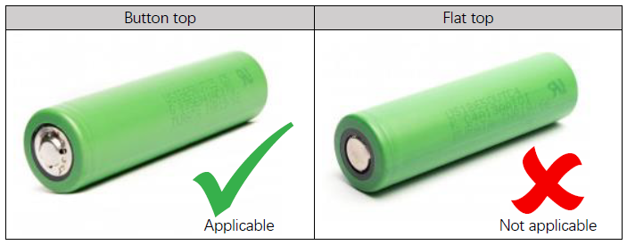

## 18650 Rechargeable Battery (3.7V) (Button Top) (No Protective Board, discharge current ≥10A)

If you do not want to purchase from the links below, please ensure that the battery meets the above requirements.

## Purchase Links

Amazon bans the sale of 18650 batteries, but you may still be able to find some there.  
There are many fake 18650 batetries, so please be careful when choosing batteires if you search them yourself.  
Generally, the 18650 batteries only have a capacity of around 3600mAh. Those marked with a capacity far beyond that number are most likely fake.  

If one purchase link fails or the battery is sold out, please try another link.  
If you need help or want to report a link failure, please contact [support@freenove.com](mailto:support@freenove.com)

### US

* https://imrbatteries.com/products/samsung-30q-18650-3000mah-15a-battery-button-top
* https://imrbatteries.com/products/panasonic-ncr18650ga-3450mah-10a-battery-button-top

### CA

* https://x2robotics.ca/18650-cell-lithium-ion-battery-with-top-tip-3-7v-3500mah?search=18650

### UK

* https://www.ecoluxshopdirect.co.uk/sanyo-ncr18650ga-3500mah-3-6v-battery-button-top
* https://www.ecoluxshopdirect.co.uk/ampsplus-18650-3000mah-15a-3-7v-battery-button-top
* https://www.ecoluxshopdirect.co.uk/panasonic-ncr18650bd-3200mah-10a-3-6v-battery-button-top

### EU

* https://eu.nkon.nl/sanyo-18650ga-button-top.html
* https://eu.nkon.nl/sony-konion-us18650vtc5-2600mah-30a-met-button-top.html
* https://www.nkon.nl/en/inr18650-mj1-buttontop.html

### AU

* https://www.tinkertechau.com.au/products/samsung-inr-18650-30q-button-top?_pos=2&_fid=ba27bb0e2&_ss=c
* https://www.tinkertechau.com.au/products/panasonic-ncr18650-b-3400mah-10a-battery-button-top?_pos=5&_fid=ba27bb0e2&_ss=c

### JP
* https://item.rakuten.co.jp/mby1112/abe3400t/
* https://item.rakuten.co.jp/oremeca/10000911/

